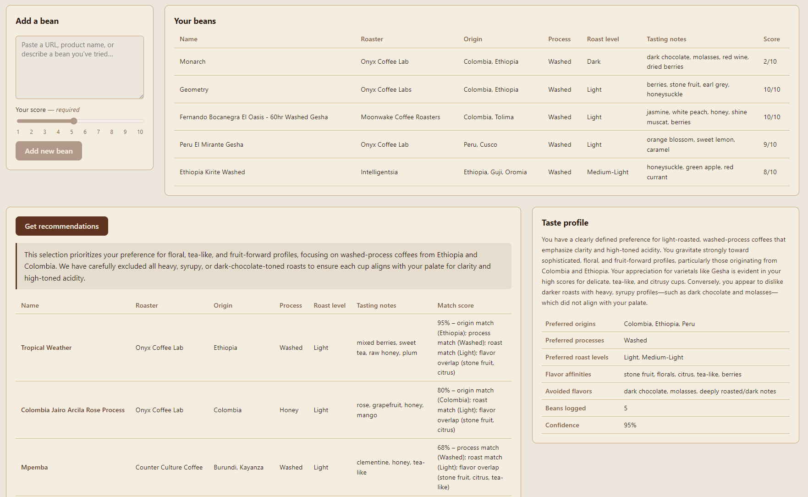
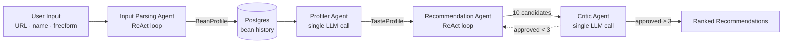
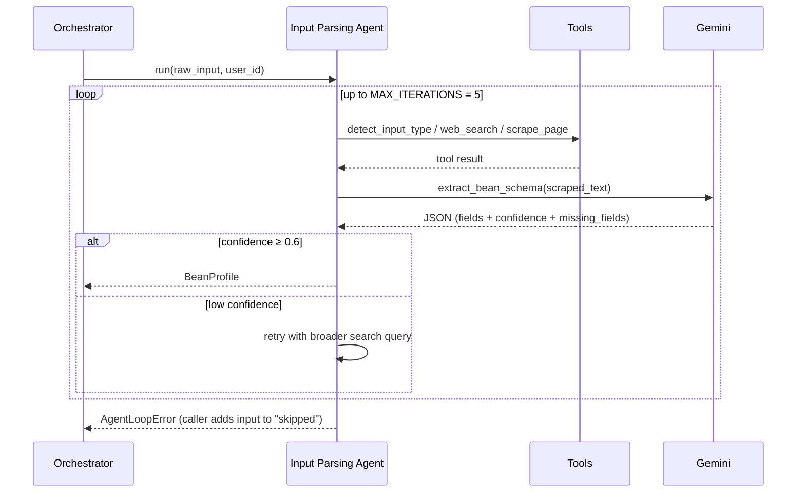
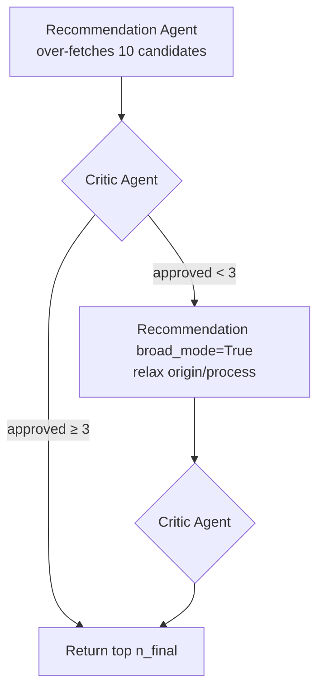

# Coffee Agent

A multi-agent coffee bean recommender. You log beans you've tried (a roaster URL, a name, or a freeform sentence), and the system parses each one into structured data, builds a persistent taste profile, scrapes real roaster catalogs, and returns ranked recommendations — with an LLM critic gating the final list for quality.

The interesting part isn't the coffee. It's the architecture: four cooperating agents, two of them running ReAct tool-use loops, a deterministic scoring rubric, and an evaluator-critic pattern that can trigger a broad-mode retry when the recommendations aren't strong enough.

## Demo

[](https://www.youtube.com/watch?v=CHNca8DlL3M)

▶ [Watch the demo on YouTube](https://www.youtube.com/watch?v=CHNca8DlL3M)

## What it does

1. **Log a bean** — paste a roaster product URL, a bean name (e.g. "Onyx Geometry"), or freeform text ("the natural Ethiopian I had at Verve").
2. **Parse** — the Input Parsing Agent resolves the input, scrapes the source page, and extracts a typed `BeanProfile` (origin, process, roast level, tasting notes, confidence score).
3. **Profile** — the Profiler Agent reads the user's full bean history and produces a `TasteProfile` (preferred origins, processes, roast levels, flavor affinities, avoided flavors, narrative summary).
4. **Recommend** — the Recommendation Agent searches a curated list of roaster catalogs, scores each candidate against the taste profile, and over-fetches 10 candidates.
5. **Critique** — the Critic Agent prunes low-quality matches, enforces roaster diversity, and returns the final ranked list. If fewer than 3 candidates survive, the orchestrator triggers a broad-mode retry.

## How it works

### Pipeline at a glance



Sequencing, retries, and trace spans are pure Python in [`app/agents/orchestrator.py`](app/agents/orchestrator.py) — no LLM call.

### The four agents

| Agent | Role | LLM pattern | Tools | I/O |
|---|---|---|---|---|
| **Input Parsing** ([`input_parsing.py`](app/agents/input_parsing.py)) | Resolve raw input → structured `BeanProfile` | ReAct loop, max 5 iterations | `detect_input_type`, `web_search`, `scrape_page` | `str` → `BeanProfile` |
| **Profiler** ([`profiler.py`](app/agents/profiler.py)) | Aggregate full bean history into a taste profile | Single LLM call | — | `list[BeanProfile]` → `TasteProfile` |
| **Recommendation** ([`recommendation.py`](app/agents/recommendation.py)) | Search roaster catalogs, score candidates | ReAct loop with `broad_mode` flag | `web_search`, `scrape_roaster_catalog`, `score_candidate` | `TasteProfile` → `list[RecommendationCandidate]` |
| **Critic** ([`critic.py`](app/agents/critic.py)) | Prune, diversify, and rank final list | Single LLM call | — | `list[Candidate]` → pruned list + `critic_notes` |

### ReAct loop mechanics

The two agents that need real tool use (Input Parsing and Recommendation) implement a bounded ReAct loop. The Input Parsing flow:



Three things are worth noting:

- **Bounded iteration.** `MAX_ITERATIONS = 5` per agent, raised as `AgentLoopError` on overrun. The orchestrator catches per-input and continues — one bad URL doesn't kill a batch.
- **Structured output, not freeform.** Every LLM call ends with `"Return only valid JSON. No preamble, no markdown fences."` The wrapper in [`app/llm.py`](app/llm.py) strips fences if the model wraps its output anyway, enforces a 1 s rate-limit window, and retries once on HTTP 429.
- **Confidence as a control signal.** Low-confidence parses trigger a retry with a broader query rather than failing closed.

### Critic / evaluator pattern

Recommendation and Critic are intentionally split:



Why this split matters:

- **Decoupled quality gate.** The Recommendation Agent optimizes for recall (find candidates that match the rubric); the Critic optimizes for precision (would a barista actually hand you this bean?). Coupling them into one prompt regresses both.
- **Diversity enforcement.** The Critic caps any single roaster at 2 candidates, which the scoring rubric alone can't express.
- **Self-healing.** If the Critic approves fewer than 3 candidates, the orchestrator transparently retries the Recommendation Agent with `broad_mode=True` — relaxing origin and process constraints — and re-runs the Critic. One retry, then return what we have.

### Deterministic scoring + LLM qualitative review

Ranking is computed by a fixed rubric in [`app/tools/scorer.py`](app/tools/scorer.py):

| Signal | Weight |
|---|---|
| Origin match | **+0.4** |
| Roast level match | **+0.3** |
| Process match | **+0.2** |
| Flavor affinity overlap (graded match via [`flavor_hierarchy.py`](app/tools/flavor_hierarchy.py)) | **up to +0.3** |
| Avoided flavor present | **−0.3** |
| Final score | clamped to `[0.0, 0.95]` |

Flavor matching isn't naive set intersection — it walks a flavor hierarchy so `"peach"` partially matches `"stone fruit"`. The Critic Agent reads these scores and rationales, but **does not produce them** — keeping the numbers reproducible and auditable. The LLM's job is qualitative review on top: "is this set actually good?", not "what number does this bean deserve?". This is a deliberate boundary: LLMs are asked to do the part where judgment beats arithmetic, and nothing else.

### Data contracts

Agents pass typed Pydantic v2 objects, not strings. Defined in [`app/models/`](app/models/):

- **`BeanProfile`** — one logged bean. Identity, origin, process, roast, tasting notes, plus parsing metadata (`confidence`, `missing_fields`, `input_raw`, `input_type`).
- **`TasteProfile`** — one per user, upserted. Preferred origins/processes/roast levels, flavor affinities, avoided flavors, narrative summary, history stats.
- **`RecommendationCandidate`** — one scored candidate. Includes `match_score` and `match_rationale` from the deterministic scorer.
- **`RecommendationResponse`** — final API payload: taste profile + ranked candidates + critic notes.

Persistence: `bean_profiles` has a `UNIQUE(user_id, roaster, name)` constraint and all writes go through upserts in [`app/db/queries.py`](app/db/queries.py). Schema in [`app/db/migrations/001_init.sql`](app/db/migrations/001_init.sql). The full design doc is at [`.claude/coffee_agent_prd.md`](.claude/coffee_agent_prd.md).

## Tech stack

FastAPI · asyncpg · Pydantic v2 · `google-genai` (Gemini) · BeautifulSoup · Brave Search · React + Vite frontend

---

## Setup & run

### Prerequisites

- Python 3.11+
- Node.js 18+
- PostgreSQL

### Backend

```bash
pip install -e ".[dev]"
cp .env.example .env
```

Required `.env` values:

| Variable | Description |
|---|---|
| `DATABASE_URL` | PostgreSQL connection string |
| `GOOGLE_API_KEY` | Gemini API key |
| `BRAVE_API_KEY` | Brave Search API key |
| `GEMINI_MODEL` | (optional) defaults to `gemini-3.1-flash-lite-preview` |

### Frontend

```bash
cd frontend
npm install
```

### Running locally

Two terminals:

```bash
# Terminal 1 — backend (port 8000)
uvicorn app.main:app --reload

# Terminal 2 — frontend (port 5173)
cd frontend
npm run dev
```

Then open [http://localhost:5173](http://localhost:5173). The frontend proxies `/api/*` to the backend, so no CORS configuration is needed in development.

### Tests

```bash
pytest                  # unit tests
pytest --integration    # hits real APIs — requires .env with valid keys
```
