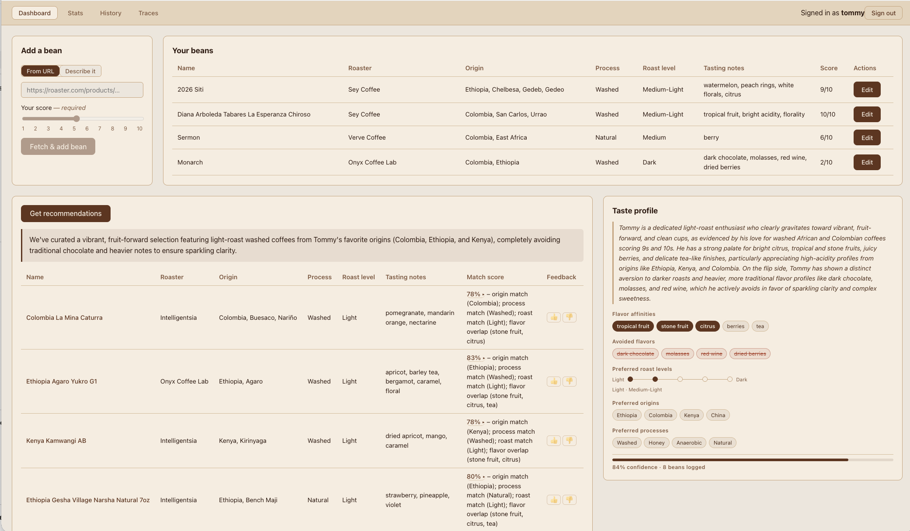
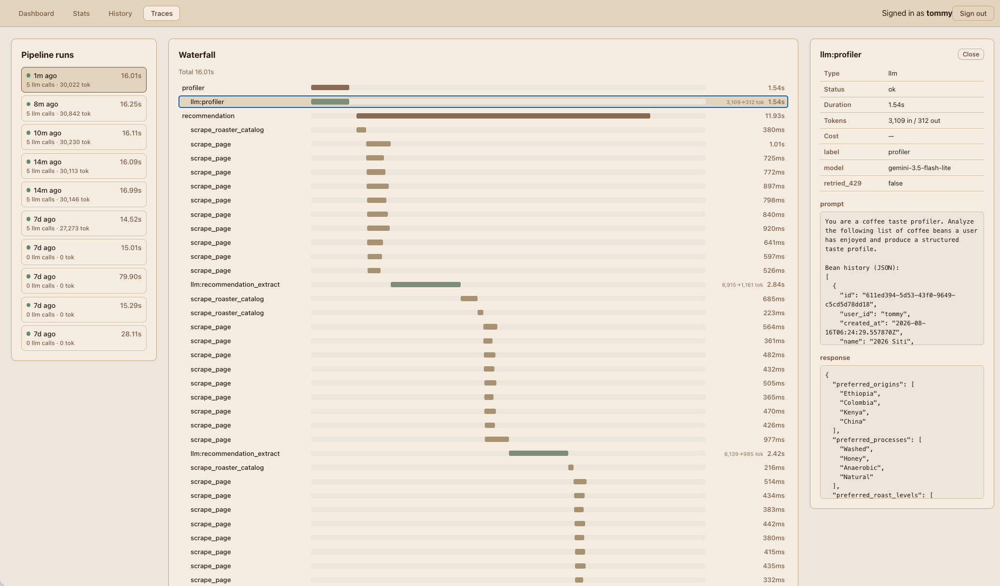
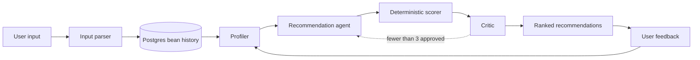

# Coffee Agent

Coffee Agent is a full-stack coffee recommender that turns a user's coffee history into a taste profile, searches live roaster catalogs, and returns reviewed recommendations. It pairs deterministic scoring with LLM extraction and qualitative review, while preserving recommendation history, feedback, live progress, and per-run traces.

## Product



The dashboard lets a user log beans from a product URL, a coffee name, or free-form text; edit the extracted details and score; generate recommendations; and give each recommendation a thumbs-up or thumbs-down. The app also includes Stats, History, and Traces views.



The Traces view records each recommendation run as an inspectable waterfall, including agent and tool spans, token counts, durations, and estimated LLM cost.

## What it does

1. **Log beans.** The parser resolves a URL, name, or free-form description into a typed `BeanProfile`. Logged beans can be edited and rated from 1 to 10.
2. **Build a taste profile.** The Profiler analyzes at least three saved beans, weighting high and low scores differently and incorporating recommendation feedback.
3. **Search and score catalog coffees.** The Recommendation Agent scrapes curated roaster catalogs, extracts product details in batches, and scores candidates with a deterministic rubric.
4. **Review recommendations.** The Critic removes weak fits, limits any roaster to two results, and supplies a concise explanation of the final set.
5. **Learn from feedback.** Downvoted coffees are excluded from future runs; both positive and negative feedback are included in the next profile generation.

## How it works


```mermaid
flowchart LR
  U[User input] --> I[Input parser]
  I --> B[(Postgres bean history)]
  B --> P[Profiler]
  P --> R[Recommendation agent]
  R --> S[Deterministic scorer]
  S --> C[Critic]
  C --> O[Ranked recommendations]
  O --> F[User feedback]
  F --> P
  C -. fewer than 3 approved .-> R
```

The orchestrator in [`app/agents/orchestrator.py`](app/agents/orchestrator.py) owns sequencing, persistence, progress reporting, tracing, and one bounded revision round. It does not make LLM calls itself.

### Agents and control flow

| Component | What it does | LLM use |
|---|---|---|
| **Input Parsing** ([`input_parsing.py`](app/agents/input_parsing.py)) | Detects the input type, searches/scrapes a source, and extracts a `BeanProfile`. Low-confidence results may retry with a broader search. | Structured extraction; invalid JSON gets one retry per attempt. |
| **Profiler** ([`profiler.py`](app/agents/profiler.py)) | Converts bean history and recommendation feedback into a `TasteProfile`. | One structured call, with one JSON retry. |
| **Recommendation** ([`recommendation.py`](app/agents/recommendation.py)) | Scrapes roaster catalogs, batch-extracts product details, scores each candidate, and filters revision candidates against critic objections. | One batch extraction per roaster, with a JSON retry when needed; an optional objection-filter call during revision. |
| **Critic** ([`critic.py`](app/agents/critic.py)) | Prunes and reranks candidates, enforces diversity, and explains the set. | One structured call, with one JSON retry. |

The input parser has a maximum of five attempts. Recommendation runs start with four roasters and examine all eight on a revision round. If the Critic approves fewer than three candidates, the orchestrator makes exactly one broader retry: it excludes coffees already reviewed and passes the Critic's objections to the Recommendation Agent before a second review.

### Deterministic scoring

[`app/tools/scorer.py`](app/tools/scorer.py) calculates a candidate's `match_score`; the Critic reviews those results but does not invent scores.

| Signal | Weight |
|---|---:|
| Origin match | +0.4 |
| Roast-level match | +0.3 |
| Process match | +0.2 |
| Flavor-affinity overlap | up to +0.3 |
| Avoided flavor | −0.3 |
| Final score | clamped to `0.0–0.95` |

Flavor matching uses [`flavor_hierarchy.py`](app/tools/flavor_hierarchy.py), so related terms such as `peach` and `stone fruit` receive partial credit.

### Data and observability

Agents exchange Pydantic models from [`app/models/`](app/models/). PostgreSQL stores users, bean profiles, taste profiles, recommendation runs (including profile snapshots and traces), and recommendation feedback. Bean persistence is an upsert keyed by `(user_id, roaster, name)`.

Every recommendation run records nested agent, LLM, and tool spans. The frontend polls progress while a run is active, and the Traces view shows duration, token usage, captured LLM responses, and estimated cost when token and model data are available.

## Tech stack

- Backend: FastAPI, asyncpg, Pydantic v2, `google-genai`, HTTPX, Beautiful Soup
- Search: Brave Search API
- Frontend: React 18, TypeScript, Vite, TanStack Query
- Database: PostgreSQL

## Setup and run

### Prerequisites

- Python 3.11+
- Node.js 18+
- PostgreSQL

### Install

```bash
pip install -e ".[dev]"
cp .env.example .env

cd frontend
npm install
```

Set these values in `.env`:

| Variable | Required | Description |
|---|---|---|
| `DATABASE_URL` | Yes | PostgreSQL connection string |
| `GOOGLE_API_KEY` | Yes for LLM-backed workflows | Gemini API key |
| `BRAVE_API_KEY` | Yes for name/free-form input search | Brave Search API key |
| `GEMINI_MODEL` | No | Overrides the default `gemini-3.5-flash-lite` model |

### Run locally

In separate terminals:

```bash
# Backend — port 8000
uvicorn app.main:app --reload
```

```bash
# Frontend — port 5173
cd frontend
npm run dev
```

Open [http://localhost:5173](http://localhost:5173). During development, Vite proxies `/api/*` to the backend.

### Test and build

```bash
pytest
pytest --integration  # requires valid .env credentials and reaches external APIs

cd frontend
npm run lint
npm run build
```
